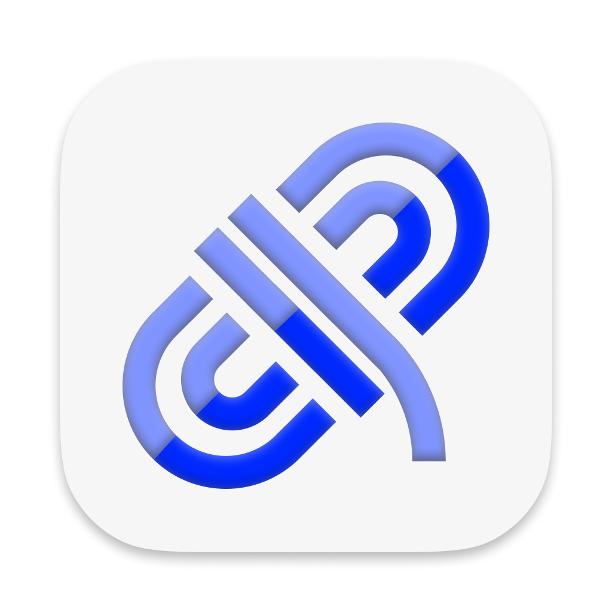
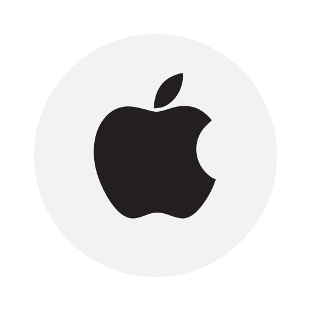
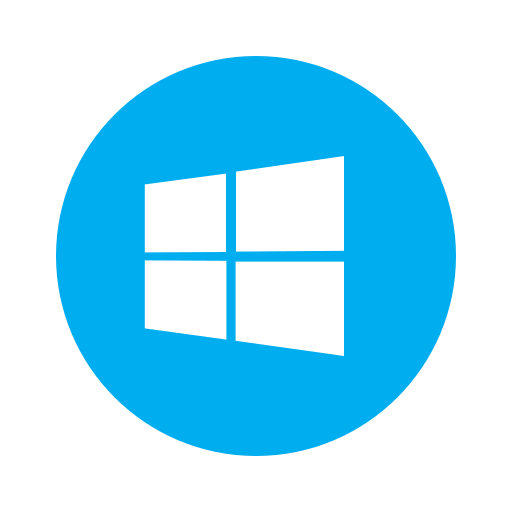
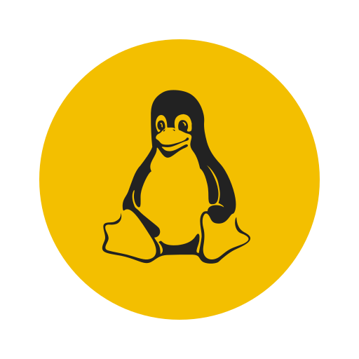

[![Contributors][contributors-shield]][contributors-url]
[![Forks][forks-shield]][forks-url]

[![Issues][issues-shield]][issues-url]
[![MIT License][license-shield]][license-url]

 

  

<h3 align="center">kubelinkr</h3>

  

    Port forward your kubernetes pods with a desktop application.
     
     
    <a href="#download">Download</a>
    ·
    <a href="https://github.com/donnercody/kubelinkr/issues">Report Bug</a>
    ·
    <a href="https://github.com/donnercody/kubelinkr/issues">Request Feature</a>
  

<!-- TABLE OF CONTENTS -->

  
Table of Contents

  <ol>
    <li>
      <a href="#about-the-project">About kubelinkr</a>
      <ul>
        <li><a href="#built-with">Built With</a></li>
      </ul>
    </li>
    <li>
      <a href="#getting-started">Getting Started</a>
      <ul>
        <li><a href="#prerequisites">Prerequisites</a></li>
        <li><a href="#installation">Installation</a></li>
      </ul>
    </li>
    <li><a href="#usage">Usage</a></li>
    <li><a href="#roadmap">Roadmap</a></li>
    <li><a href="#contributing">Contributing</a></li>
    <li><a href="#license">License</a></li>
    <li><a href="#contact">Contact</a></li>
    <li><a href="#acknowledgments">Acknowledgments</a></li>
  </ol>

<!-- ABOUT THE PROJECT -->
## About kubelinkr

![Product Name Screen Shot][product-screenshot]

When you try to port-forward into kubernetes clusters, you always have to change your current-context, know the names of the pods and the ports they are running on. This is a tedious process and can be automated with a desktop application. This is where kubelinkr comes in. It is a desktop application that allows you to port-forward into your kubernetes pods with a few clicks.

Here's why:
* Convenience: You can port-forward into multiple pods with one click.
* Always available: The application is in your tray and can be accessed with a single click.
* Switch stages: You can switch between different kubernetes contexts with a single click and activate and automatically deactive another stage (dev, test, live and more)

(<a href="#readme-top">back to top</a>)

<!-- GETTING STARTED -->
## Download 

Here are the download versions for Mac. (Windows and Linux will come later)

<table>
<tr>
<td style="text-align: center">

</td>
<td style="text-align: center">

</td>
<td style="text-align: center">

</td>
</tr>
<tr>
<td style="text-align: center">

<a href="https://github.com/donnercody/kubelinkr/releases/download/v1.0.7/kubelinkr-1.0.7.dmg">Download Mac</a>

<a href="https://github.com/donnercody/kubelinkr/releases/download/v1.0.7/kubelinkr-1.0.7-arm64.dmg">Download Mac (ARM)</a>

</td>
<td style="text-align: center">
Coming Soon</td>
<td style="text-align: center">
Coming soon
</td>
</tr>
</table>

(<a href="#readme-top">back to top</a>)

<!-- USAGE EXAMPLES -->
### Usage

Here are some Screenshots to show the application when you show the window. While the application is running only in background and you only see the tray icon.

_For more details, please refer to the [Medium Post](https://example.com)_

(<a href="#readme-top">back to top</a>)

<!-- ROADMAP -->
## Roadmap

- [ ] Add Changelog
- [ ] Support Services instead of Pods
- [ ] Multi-language Support
  - [ ] Chinese
  - [ ] Spanish

See the [open issues](https://github.com/donnercody/kubelinkr/issues) for a full list of proposed features (and known issues).

(<a href="#readme-top">back to top</a>)

### Built With

This section should list any major frameworks/libraries used to bootstrap your project. Leave any add-ons/plugins for the acknowledgements section. Here are a few examples.

* [![React][React.js]][React-url]
* [![Electron][Electron]][Electron-url]
* [![Blueprint][Blueprint]][Blueprint-url]

(<a href="#readme-top">back to top</a>)

<!-- LICENSE -->
## License

Distributed under the MIT License. See `LICENSE.txt` for more information.

(<a href="#readme-top">back to top</a>)

<!-- CONTACT -->
## Contact

Your Name - Thoren Lederer

Project Link: [https://github.com/donnercody/kubelinkr](https://github.com/your_username/repo_name)

(<a href="#readme-top">back to top</a>)

<!-- ACKNOWLEDGMENTS -->
## Acknowledgments

Use this space to list resources you find helpful and would like to give credit to. I've included a few of my favorites to kick things off!

* [GitHub Pages](https://pages.github.com)
* [Font Awesome](https://fontawesome.com)
* [React](https://reactjs.org/)
* [Electron](https://www.electronjs.org/)
* [Blueprint](https://blueprintjs.com/)

(<a href="#readme-top">back to top</a>)

<!-- MARKDOWN LINKS & IMAGES -->
<!-- https://www.markdownguide.org/basic-syntax/#reference-style-links -->
[contributors-shield]: https://img.shields.io/github/contributors/donnercody/kubelinkr.svg?style=for-the-badge
[contributors-url]: https://github.com/donnercody/kubelinkr/graphs/contributors
[forks-shield]: https://img.shields.io/github/forks/donnercody/kubelinkr.svg?style=for-the-badge
[forks-url]: https://github.com/donnercody/kubelinkr/network/members
[stars-shield]: https://img.shields.io/github/stars/donnercody/kubelinkr.svg?style=for-the-badge
[stars-url]: https://github.com/donnercody/kubelinkr/stargazers
[issues-shield]: https://img.shields.io/github/issues/donnercody/kubelinkr.svg?style=for-the-badge
[issues-url]: https://github.com/donnercody/kubelinkr/issues
[license-shield]: https://img.shields.io/github/license/donnercody/kubelinkr.svg?style=for-the-badge
[license-url]: https://github.com/donnercody/kubelinkr/blob/master/LICENSE.txt
[linkedin-shield]: https://img.shields.io/badge/-LinkedIn-black.svg?style=for-the-badge&logo=linkedin&colorB=555
[product-screenshot]: readme/screenshots/readme_banner.png
[React.js]: https://img.shields.io/badge/React-20232A?style=for-the-badge&logo=react&logoColor=61DAFB
[React-url]: https://reactjs.org/
[Electron]: https://img.shields.io/badge/Electron-191970?style=for-the-badge&logo=electron&logoColor=white
[Electron-url]: https://www.electronjs.org/
[Blueprint]: https://img.shields.io/badge/Blueprint-30404D?style=for-the-badge&logo=blueprint&logoColor=white
[Blueprint-url]: https://blueprintjs.com/
[Medium-post]: https://example.com

